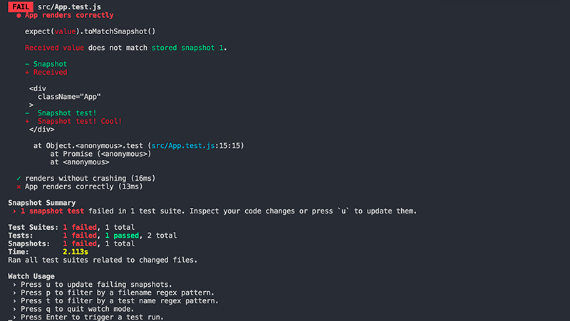

I've been spending more and more time with Jest lately and, increasingly, one of my favorite features is [snapshots](https://facebook.github.io/jest/docs/en/snapshot-testing.html#content). In the past, I've [written](https://css-tricks.com/visual-regression-testing-with-phantomcss/) and [talked](https://jonbellah.com/talks/2016/front-porch) a lot about visual regression testing, but snapshot testing is a bit of a new concept to me.

In fact, the first time I heard about snapshot testing, I thought it was just a different term for visual regression testing. It turns out, that's not the case... snapshots are totally different and totally awesome (though, I do still believe they solve some of the same problems, but we'll get to that in a bit).

### What is snapshot testing?

Snapshot testing is a form of regression testing that verifies that your UI does not change unexpectedly. A snapshot test does not test the *visual* representation of a component, but instead uses a JSON representation of a rendered component. You can think of it kind of it a little like copying markup from the browser inspector, except that snapshot tests also contain useful things like props, inline event handlers, etc.

In the simplest form, a snapshot test would look something like the following. Let's say we have just a stateless, functional component called `App` that just spits out a `div` with some text in it.

```js
// App.js
import React from 'react';

const App = () => (
	<div className="App">
		Snapshot test!
	</div>
);

export default App;
```

We could write a pretty simple snapshot test that would look like:
```js
// App.test.js
import React from 'react';
import renderer from 'react-test-renderer';
import App from './App';

test('App renders correctly', () => {
	const tree = renderer.create(
		<App />
	).toJSON();
	expect(tree).toMatchSnapshot();
});
```

Which, when run, would give us a `.snap` file that looks like:
```js
// __snapshots__/App.test.js.snap
exports[`App renders correctly 1`] = `
<div
  className="App"
>
  Snapshot test!
</div>
`;
```

There's a lot going on here, so let's break it down a little bit.

In our `App.test.js` file, on the second line we import our Jest snapshot renderer (`react-test-renderer`) so that we can use it to create our snapshots. Then we use `renderer.create` to render our component in memory, as an object named `tree`.

Finally, we use Jest's `expect()`, pass in the `tree` object that we just created, and use the [.toMatchSnapshot()](https://facebook.github.io/jest/docs/expect.html#tomatchsnapshotoptionalstring) matcher to determine whether our component matches our snapshot.

If a previous snapshot does not exist, Jest will create one (in this case, our `App.test.js.snap` file). Any subsequent Jest runs will follow the same process, but will then begin comparing the new snapshot to the original.

If a change is detected, the test will fail. Jest then asks if you'd like to update the snapshot, which we can quickly and easily do via the command line with `$ jest -u`. If the change is unexpected, you can go back, fix the component, and keep moving.



### Why use snapshot tests?

There are a couple reasons that I like using snapshot testing on projects. The first is just simplicity, with only a few lines of code I'm able to capture a snapshot of what a component looked like at a point in time when I was confident that the output was correct. As applications increase in size and complexity, I believe that finding areas where you can simplify becomes crucial.

> Classic assertion based tests are perfect for testing clearly defined behavior that is expected to remain relatively stable. Snapshot tests are great for testing less clearly defined behavior that may change often.
> <cite>[Ben McCormick](https://benmccormick.org/2016/09/19/testing-with-jest-snapshots-first-impressions/)</cite>

Secondly, I think snapshot testing helps create a broader, more complete (and, thus, healthier) testing suite. I believe that adding snapshot testing to an arsenal of unit, functional, and acceptance testing will only help build stronger software. Snapshots are not a replacement for other types of testing, they're complimentary.

### Snapshot testing workflow

Snapshot tests should be written *after* a component has been built, contrary to what some popular testing methodologies (like TDD) would recommend. That's not to say that snapshot testing can't play nicely with TDD approaches, though.

While I don't personally employ a TDD approach in my own work (the nature of agency work tends to make TDD difficult, in my experience), I like the idea of bookending development with testing, taking a TDD approach to unit and functional tests (writing the tests before the component is built). Then once the component passes the established tests, add a snapshot test to keep an eye out for regressions in the UI.

Another important piece to note is that with snapshot testing, you should always commit your snapshots to your repo. If you're working on a project with a distributed team, or even by yourself on multiple machines, it's critical that everyone use the same source of truth.

### Do snapshots replace visual regression testing?

As I mentioned before, visual regression testing is a topic that I have written a lot about, spoken about at conferences, and have generally been passionate about for years. That said, I believe that snapshot testing takes much of the pain that was inherent with VRT.

Visual tests can fail for a number of reasons that make them particularly difficult to work with; for example, sub-pixel antialiasing can render slightly differently across different machines. Or if you want to test real components, as opposed to a style guide, you need to set up dynamic content replacement so that your visual suite was always testing against a predictable UI.

All of these problems added up to make visual regression testing an unpopular choice for many long-term projects. If testing becomes unnecessarily time consuming, difficult, or generally painful, developers just won't do it.

In fact, one of the most common responses to the discussion of visual regression testing is "but I change my CSS because I want things to look different." And that's very true. The friction of constant feedback for each and every *intended* change can, frankly, be pretty annoying.

That said, I still believe that VRT still plays an extremely important role in one common scenario: refactoring. Snapshot testing just is not intended to solve the problem of actual visual changes. 

### Further Reading

All in all, I've really enjoyed digging deeper into snapshot testing and can now say I am a fan. While researching this post, I came across some solid resources that I'd recommend as further reading:

- [Jest Docs](https://facebook.github.io/jest/docs/en/snapshot-testing.html)
- [Testing with Jest Snapshots: First Impressions](https://benmccormick.org/2016/09/19/testing-with-jest-snapshots-first-impressions/)
- [Snapshot Testing React with Jest](https://www.codeproject.com/Articles/1180478/Snapshot-Testing-React-with-Jest)
- [Snapshot Testing React Components with Jest](https://medium.com/@luisvieira_gmr/snapshot-testing-react-components-with-jest-3455d73932a4)