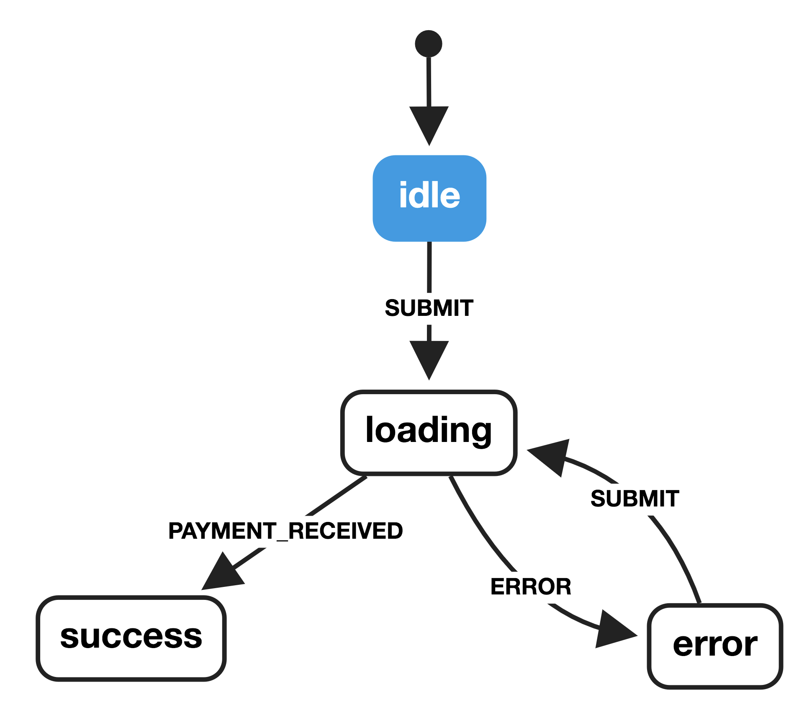

I first started building things for the web in the late 90s, when I was about 11 or 12 years old. For the first several years, I mostly spent my time building sites dedicated to videogames that I was playing. At the time, Microsoft FrontPage was my tool of choice.

As time went on, the sites I wanted to build started to grow in complexity — I wanted to add blog posts and forums and the like. As a result, FrontPage gave way to using Notepad and learning my way around PHP and JavaScript.

With each step in my evolution as a developer, I’ve learned to build increasingly complex websites and applications.

As front-end engineers working on the web today, building interfaces is an extraordinarily challenging undertaking. We have to account for so many variables, both controlled and uncontrolled, that weren’t really a _thing_ when I started out — accessibility, performance, shifting project requirements, accounting for different devices and browsers and operating systems and connections, the onslaught of new frameworks and technologies… just to name a few.

Recently, I’ve been focusing a lot of my time on trying to simplify that process in any way I can. Tools like Prettier have helped make code formatting an afterthought, ESLint ensures I’m following good coding practices, Lighthouse gives me an easy way to check the performance and accessibility of my applications are up to snuff.

But one of the most compelling changes I’ve made in my approach came a little over a year ago when I started introducing the use of state machines and statecharts in my applications. 

Over the last several years, there has been a ton of innovation in the realm of state management; from Redux to MobX to Vuex and beyond. There’s an important distinction, though, in that state machines and statecharts don’t really concern themselves with how you *manage* your state, but instead with how you *design* your state.

When I first started learning about state machines, I found it really difficult to make the connection between defining a state machine and how to actually use them to power a real, functioning application. 

_Great… I can model a stoplight… but what happens when I need to load data, handle user interactions, or anything that actually resembles building a real, functioning application?_

So, my goal in this post is to distill all of the scary stuff down to something that is understandable and approachable. We’re not going to cover any of the mathematical or computer science-y stuff here. No automata theory or discussions about the differences between Mealy and Moore machines. This will be 100% pure, unadulterated _what are state machines and how do I  use them in my javascript applications_.

### A brief introduction to state machines and statecharts
A state machine, per the academic definition, is any abstract machine that can be in exactly one of a finite number of states at a given time. A state machine should concern itself with the behavior of an isolated, discrete component or piece of logic.

For example, a `Promise` is a [state machine](https://www.promisejs.org/implementing/). It has a finite, deterministic set of states that it can exist in: `PENDING`, `REJECTED`, or `FULFILLED`. 

Statecharts, which I will reference a few times here, are a formalism that extend state machines to include three core concepts: hierarchy, parallelism, and communication. With statecharts, we can model each discrete piece of logic in our application with a state machine, then visualize how each of those pieces fit together to form a complete application. If you’re interested in learning more about statecharts, check out [the paper](http://www.inf.ed.ac.uk/teaching/courses/seoc/2005_2006/resources/statecharts.pdf) that David Harel wrote in 1987 that started it all off.

It’s also worth noting that between 2005 and 2015, the W3C actually standardized [SCXML](https://www.w3.org/TR/scxml/) (State Chart extensible Markup Language). David Khourshid, who maintains xstate, has put a strong emphasis on ensuring that xstate is compatible with SCXML as much as possible.

### Why state machines and statecharts?
>  “A statechart is a magic box, you tell it what happened and it tells you what to do.” - Luca Matteis

State machines have been a mainstay in other areas of computer programming for many, many years, primarily due to their predictability. They’ve only recently started to make their way into the zeitgeist of javascript developers.

NASA uses state machines to [model the Space Launch System solid rocket boosters](https://ti.arc.nasa.gov/publications/10841/download/). They’ve been written about in [biology papers](https://www.ncbi.nlm.nih.gov/pubmed/24932713) on understanding the behaviors and states of cells and gene regulatory networks. Videogame developers have [leaned on state machines](http://gameprogrammingpatterns.com/state.html) for decades. They’re common in the code that powers aviation systems — in fact, David Harel created statecharts while [working with the Israel Aircraft Industries](http://www.wisdom.weizmann.ac.il/~harel/papers/Statecharts.History.pdf) in the early 1980s.

In the past, state in my code was always implicit — typically taking the form of boolean flags littered throughout my code (`isLoading`, `isFetching`, etc). State machines allow me to make that state _explicit_ and provide clear instructions on when and how that state should change, giving me strong control over the behavior of my applications.

### A paradigm shift
Typically, when building applications, most developers tend to follow what’s known as the *event-action paradigm* — where an event happens in the application and an action is dispatched in response. This was the way that I built the vast majority of applications in my career.

State machines and statecharts, on the other hand, represent the *event-state-action paradigm* — where an event happens in the application, the application transitions state accordingly, then actions are dispatched in response to the new state. 

This paradigm shift is incredibly important. By executing actions in response to state, instead of events, makes the genesis of those actions very transparent and easy to trace and makes your applications less prone to random bugs.

For example, someone clicks on a button to submit a payment, but the UI doesn’t respond quickly enough and they click the payment button a couple more times. Following the event-action paradigm, if we didn’t properly disable the button (or if the user was savvy enough to remove the disabled flag via the console), we could end up submitting that payment request a few times. Not good.

Following the event-state-action paradigm, however, when the user clicks the button to submit payment, our component could transition into a loading state. While in that loading state, it does not respond to any new submit actions. From that loading state, it can only transition to a successful or error state — then from that error state the user would be able to re-submit the form.

### State machines in action
The component-driven model of most modern frameworks — React, Vue, Angular, etc — is quite favorable for using state machines.

Typically, I prefer to model each stateful component with its own state machine and colocate that code alongside my component code. That way, when someone else picks up an application that I’ve been working on and starts to read through my code, it;s clear how that component should behave.

Now that we’ve covered the _what_ and _why_, let’s dive right into the _how”_ In the following examples, we’ll build the payment submission form that I mentioned earlier.

Note: I’m going to use React, since that’s my forte, but these concepts can be applied to any framework (or no framework at all). [xstate](https://github.com/davidkpiano/xstate) is completely framework agnostic.

### Modeling the component behavior
The first step I take when building a component is to model the behavior of that component with a state diagram. Typically, I’ll start by sketching out the state diagram on paper showing all of the various states that the component should be able to exist in.

Our payment form should have four states: idle, loading, success, error.

The idle state is the initial state for the form. From the idle state, we will transition to the loading state when we observe the `SUBMIT` event.  When we enter the loading state, we’ll trigger a `POST` request to our backend service, then transition to either the success or error states depending on the result of that request.

We can model the above behavior with a state diagram like so:



As you can see in the diagram above, each of the states we modeled has been accounted for, as well as each of the corresponding transitions.

If we happen to be in the idle state and observe a `PAYMENT_RECEIVED` event, our state machine will not transition to the success state. It will only respond when it observes the `SUBMIT` event, meaning we know exactly how our component will behave in any given scenario.

Since we’re able to create a visual representation of the way that our component behaves, we can actually use this as a basis of discussion with designers, product managers, clients, etc. to ensure that the modeled behavior matches the expectations of everyone on the team.

Designers can use state diagrams to inform their designs, product managers can use them to inform user flows and telemetry, and so on down the line. Having state diagrams as a starting place for discussions allows everyone to be on the same page, without any guesswork as to what is being built or _how_ it is being built.

### From state diagram to code
Now that we have modeled the behavior of our component with a state diagram, we can start translating that diagram into the code that will power our component.

When it comes to state machines and statecharts in JavaScript, I always prefer to use [xstate](https://github.com/davidkpiano/xstate).  We can describe our state diagram as a JavaScript object and pass it to xstate, which will provide us some methods and helpers for executing our code.

So let’s start by describing the four states in our payment form and the transitions that can occur between them.

```js
import { Machine } from 'xstate';

const stateMachine = Machine({
  initial: 'idle',
  states: {
    idle: {
      on: {
        SUBMIT: 'loading',
      }
    },
    loading: {
      on: {
        PAYMENT_RECEIVED: 'success',
        PAYMENT_FAILED: 'error',
      }
    },
    error: {
      on: {
        SUBMIT: 'loading',
      }
    },
    success: {
      type: 'final',
    }
  }
});
```

> Note: the `type: 'final'` syntax here will be available in the next major version (4.0) of xstate. If you’re using 3.x, success can be defined as an empty object representing the final state — `success: {}`.

Now that we have defined our state machine in a format that our component code can use, we can double check the accuracy and completeness of our state machine code by passing that code to [xviz](https://bit.ly/xstate-viz).

_In fact the state diagram in this article above was generated with xviz._

Once we’ve visualized the code with xviz, we can actually walk through each of the possible event types — by clicking on the info tab — and see how our state machine will respond. 

### Scaffolding our React component
Before we go too much further, we should set up a basic React component. For this demo, we’re only going to include the name and credit card fields.

I've gone ahead and set up a CodePen example of the barebones component that we will be wiring up. This pen includes all the markup and styles that we'll need for this tutorial.

<iframe height='300' scrolling='no' title='State machine payment form - unwired' src='//codepen.io/jonbellah/embed/wYBjWv/?height=300&theme-id=515&default-tab=js,result' frameborder='no' allowtransparency='true' allowfullscreen='true' style='width: 100%;'>See the Pen <a href='https://codepen.io/jonbellah/pen/wYBjWv/'>State machine payment form - unwired</a> by Jon Bellah (<a href='https://codepen.io/jonbellah'>@jonbellah</a>) on <a href='https://codepen.io'>CodePen</a>.
</iframe>

### Initializing our machine
The first thing we need to do to connect xstate with our React component is to listen for the component to mount then get the initial state from our machine and set it in our component state.

To do so, we can add the following method to our React component:

```js
componentDidMount() {
  this.setState({ machine: stateMachine.initialState });
}
```

### Creating a transition method
xstate provides us with a transition method, but xstate is a _stateless_ library — which means that it doesn’t actually keep track of the current state of our component (note: this changes with `assign()` semantics in 4.0 but we won’t be covering that here) nor does it automatically trigger any of the actions that we define in our machine. We need to provide the current state, as well as the event type, to the xstate transition method.

As a result, we should create our own transition method that we can sit between our app and xstate, where we can inject our current component state, run any actions associated with the new state, and subsequently set the new state in our component.

The following methods can be set inside our `App` component (the base code can be found in the CodePen demo above):

```js
runActions = state => {
  if (state.actions.length > 0) {
    state.actions.forEach(f => this[f]());
  }
};

transition = (eventType, extState) => {
  const newState = stateMachine.transition(
    this.state.machine.value,
    eventType,
    {
      state: this.state
    }
  );

  this.runActions(newState);

  this.setState({
    machine: newState,
    msg: extState && extState.msg ? extState.msg : ""
  });
};
```

The `runActions` method will take the `doPayment` action in our state machine definition and call it when we transition into the loading state. If you are using any of the other supported action types, check out how Michele Bertoli handles that in [react-automata](https://github.com/MicheleBertoli/react-automata/blob/master/src/withStateMachine.js#L79).

Our transition function accepts two arguments: `eventType` and `extState`. The former is a string representing the occurrence of an event in the application, and the latter is any extended state that our transition function needs to know about — such as error messages being passed from rejected promises.

### Setting up our actions
Now our component can cycle through all of the necessary states, but it doesn’t actually _do_ anything. For that we need actions.

Statecharts give us the ability to fire actions on two primary triggers: entering a state and exiting a state (Note: there are other types of actions, such as activities — which are actions that occur over time — but they’re not in the scope of what we’re going to be digging into here).

An action in xstate can be one of three types: a string, an `ActionObject` -- which is an object with an `action.type` and any other relevant properties, or a function that takes two arguments: `extState` and `event`. In this case, we’ll define it as a string and use our `runActions` method to call a class method of the same name.

We can define the action that we need on our loading state like so:

```js
loading: {
	onEntry: ['doPayment'],
	on: {
		PAYMENT_RECEIVED: 'success',
		PAYMENT_FAILED: 'error',
	}
},
```

Next, we need to create our `doPayment` function, so when we enter the loading state our machine has something to call. We can create this as a method on our `App`component.

```js
class App extends React.Component {
	doPayment = () => {
    return fakePayment()
      .then(msg => this.transition('PAYMENT_RECEIVED', { msg }))
      .catch(msg => this.transition('PAYMENT_FAILED', { msg }));
  }

	render() {
    return (
      // markup
	  )
  }
}
```

> Replace the `fakePayment()` call with a call to your own payment service. If you’d like to copy the `fakePayment()` code I’m using, check out the [CodePen demo](https://codepen.io/jonbellah/pen/oagRpX?).

Now when our state machine enters the loading state, it will fire off the `doPayment` promise. If the promise resolves, it will transition our machine into the success state, which we can use to display a success message to the user. If the promise is rejected, we can transition into the error state and display the corresponding error message to the user.

### Preventing unwanted transitions
What happens if someone clicks on the submit button before any of the fields have been filled out? We should prevent our machine from transitioning into the loading state.

Instead of guaranteeing the transition directly to the loading state, we can add a guard that checks each of our fields and ensures that it has text entered into it. This is a great place to do any field validation -- but in this article, we're just going to be checking to see whether the user has entered any text at all.

To add our guard, we can add a `cond` flag that contains a pure function that resolves to a boolean (`true` or `false`) telling our machine whether that guard condition has been met. We can also kick it up a notch by passing an array to our `SUBMIT` event transition, where the first target has our guard condition and the second target is our fallback.

```js
idle: {
  on: {
    SUBMIT: [
      {
        target: 'loading',
        cond: ({ state }) => state.name !== '' && state.card !== ''
      },
      { target: 'error' }
    ];
  }
}
```

In the above case, when the user clicks the submit button, our state machine will check the current state of our React component — which we’ll be passing to our machine — and ensures that both the name and card fields have been filled out. If so, we move them to the loading state. If not, they go to the error state.

Now what happens if the user goes to the error state and clicks `SUBMIT` again? We should perform the same check on our error state, but instead of passing an array, we can just check the condition and stay in the error state if the fields are still empty.

```js
error: {
	on: {
    SUBMIT: {
      target: 'loading',
      cond: ({ state }) => state.name !== '' && state.card !== ''
    }
  }
},
```

By now, our state machine definition should look like this:

```js
const stateMachine = Machine({
  initial: 'idle',
  states: {
    idle: {
      on: {
        SUBMIT: [
          {
            target: 'loading',
            cond: ({ state }) => state.name !== '' && state.card !== ''
          },
          { target: 'error' }
        ]
      }
    },
    loading: {
      onEntry: ['doPayment'],
      on: {
        PAYMENT_RECEIVED: 'success',
        PAYMENT_FAILED: 'error',
      }
    },
    error: {
      on: {
        SUBMIT: {
          target: 'loading',
          cond: ({ state }) => state.name !== '' && state.card !== ''
        }
      }
    },
    success: {
      type: 'final',
    }
  }
});
```

### Wiring it all up
The last thing we need to do is wire it all up so that when a user clicks the "Pay Now” button, we `preventDefault` for the form submission -- so that we don't refresh the page -- and then trigger the transition into the loading state.

For that, we can add `onSubmit={this.submitForm}` to our `<form>` element. Then we can create the `submitForm` method on our `App` class that then calls our `transition` function — which we’ll define in just a minute. 

We're creating this intermediary method so that we don't have to `preventDefault` on all calls to `transition`.

```js
formSubmit = e => {
  e.preventDefault();
	this.transition('SUBMIT');
}
```

### Parting thoughts
That’s it!

Now, we have a component that looks and behaves like so:

<iframe height='300' scrolling='no' title='State machine payment form - wired' src='//codepen.io/jonbellah/embed/oagRpX/?height=300&theme-id=515&default-tab=js,result' frameborder='no' allowtransparency='true' allowfullscreen='true' style='width: 100%;'>See the Pen <a href='https://codepen.io/jonbellah/pen/oagRpX/'>State machine payment form - wired</a> by Jon Bellah (<a href='https://codepen.io/jonbellah'>@jonbellah</a>) on <a href='https://codepen.io'>CodePen</a>.
</iframe>

It may seem like this is a lot of extra work in the name of _reducing_ complexity but, in my opinion, this extra work makes this component significantly more reliable. It also makes understanding how it works so much easier for future-me or anyone else who has to maintain this component.

Beyond the predictability benefits, working with state machines provides us with a number of other great opportunities. We can use a [shortest path algorithm](https://github.com/davidkpiano/xstate/blob/master/src/graph.ts#L295) to get a map of all the possible paths through our machine, then automatically generate tests for each of those states and transitions. We can attach analytics events to the transitions through our state machine and get a clear visualization of the path that our users take through each of our components -- which we can use to better understand how to improve the user experience.

I hope this has been helpful in demystifying state machines and statecharts for you! If you have any questions or comments, I’d love to hear from you on [Twitter](https://twitter.com/jonbellah).

> Hey, I actually made a course about building JavaScript applications with state machines and statecharts. If you want to check it out, you can find it at [learnstatemachines.com](https://learnstatemachines.com).

